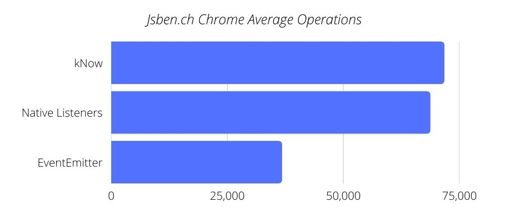

<h1 align="center">
  </img><br>
  kNow
</h1>
<p align="center">
Blazing-fast callback/promise-based events with a tiny footprint
</p>
<p align="center">
  
  
  <a href="https://www.npmjs.com/package/@elijah-bodden/know"></a>
  
  <a href="https://twitter.com/intent/tweet?text=A+tiny+event+emitter+that+packs+a+punch.&url=https%3A%2F%2Fgithub.com%2FElijah-Bodden%2FkNow&hashtags=javascript+js+opensource+javascriptdev+eventhandler+emitter+github&original_referer=http%3A%2F%2Fgithub.com%2F&tw_p=tweetbutton" target="_blank">
  </img>
  </a>
</p>

## What is this?
With kNow (pronounced "*now*"—the k's silent), JavaScript event management has never been more intuitive—or lighter-weight. Want to append custom actions to functions on-the-fly? To use awaitable timers to pause and resume execution at any time? To create large numbers of listeners without worrying about performance degradation? If so, you want kNow.  
|  |
|:--:|
| <p align="center"><i>Via https://jsben.ch/ZESbj (Avg. over 25 runs)</i></p> |  

Originally developed for use in [Membrane](https://github.com/Elijah-Bodden/Membrane), kNow is a fully functional, if lightweight, native event-management utility for any use-case.

## Getting Started
### Node.js + npm
#### Installation:
To install in the root of your node project:
```bash
npm i @elijah-bodden/know
```
Or else globally:
```bash
npm i @elijah-bodden/know -g
```
#### Use in-script
To import the module into your node script, simply paste the following line at the very top:
```JavaScript
const kNow = require('@elijah-bodden/know')
```
Then, to create a usable intance, add `const someVariable = new kNow()` anywhere, where 'someVariable' is the name you wish to access it by.
### HTML `script` tag
#### Inclusion
To include the script in your HTML, add the following tag to the top of your document:
```HTML
<script src="https://cdn.jsdelivr.net/npm/@elijah-bodden/know/index.min.js">
```
#### Use in-script
Just as with node, simply drop in `const someVariable = new kNow()` anywhere in your script, changing 'someVariable' to the name you want to reference the instance with.
## Examples
### Pause function execution for n milliseconds
```JavaScript
  const kNow = require("@elijah-bodden/know");
  const know = new kNow()
  
  async function test() {
    console.log("foo")
    console.log("bar")
    //Creates and awaits a promise that resolves in 3000ms or 3 seconds
    await know.in(3000)
    console.log("baz")
  }
  
  test()
  
  /* Expected Output:
    1. "foo"
    2. "bar"
    *Three-second pause*
    3. "baz"
  */
```

### Track changes to a variable
```JavaScript
  const kNow = require("@elijah-bodden/know");
  const know = new kNow()
  
  var variable
  
  function setVariable(newVal) {
    variable = newVal
    know.dispatch("variableChanged", variable)
  }
  
  setInterval(() => setVariable(Math.random()), 1000)
  
  //Listener callbacks can be created and destroyed at any time, on-the-fly.
  const changeListener = know.when("variableChanged", (newVal) => console.log(`Variable "variable" was changed to ${newVal}.`))

  setTimeout(() => know.clearWhen(changeListener), 5000)
  /* Expected Output:
    *1 second pause* "Variable was changed to (some value)" x 4
  */

```
### Call function X next time Y completes
```JavaScript
  const kNow = require("@elijah-bodden/know");
  const know = new kNow()

  function unpredictableFunction() {
    for (let i = 0; i < 10000000; i++) {
      //Doing some valuable operations
    }
    console.log("Alerting that task was completed.")
    know.dispatch("taskCompleted")
    setTimeout(unpredictableFunction, Math.floor(Math.random()*10000))
  }
  
  setTimeout(unpredictableFunction, Math.floor(Math.random()*10000))
  
  know.next("taskCompleted").then(() => console.log("Task completed!"))
  
  /* Expected Output:
    *Indefinite pause*
    1. "Alerting that task was completed."
    2. "Task completed!"
  */
```

## Methods
Use any of the following functions on a kNow instance to implement powerful, high-speed event handling in a snap.
| Command | Description |
| --- | --- |
| **constructor**(number) | When you initialize kNow, you can optionally pass a single argument, the length of time, in milliseconds, after which each `next` listener automatically expires. |
| **when**(number \| string, function) | Automatically attatches a callback, its second argument, which will run every time the first argument's value is `dispatched`. The function returns an `instanceID` object which can be passed into `clearWhen` to destroy the listener. |
| **clearWhen**(object \| string \| number \| undefined) | Accepts either a string or a number, an `instanceID` object, or no value. If it recieves a string or a number, kNow will unregister all `when` callbacks bound to that dispatch value; if it instead gets an `instanceID` created by `when`, only the callback created by this call will be destroyed. Otherwise, if the value is `undefined`, all callbacks registered to all `ID`'s will be destroyed simultaneously. |
| **dispatch**(number \| string, any) | Immediately resolves all promises bound through `next` to the first parameter, and invokes all callbacks attatched to it by `when`. All promises will resolve to the second argument, which will also be passed to all callback functions.|
| **forceReject**(number \| string, any) | `forceReject` does the exact opposite of `dispatch`, batch-rejecting all promises attatched to the first argument and setting the `reason`s to the second. |
| **next**(number \| string, number \| undefined) | `next` returns a promise which may either be resolved by `dispatching` the value provided as the first parameter, or rejected through `clearNext` or `forceReject`. Optionally, a second argument, a timeout, may be specified, after which to automatically reject to promise. If this argument is omited, it will default to the value provided to the constructor, and if this too is undefined, there will be no timeout. |
| **clearnext**(...string \| number \| undefined) | Accepts a list of dispatch ID's; if none are provided, it defaults to every registered ID. Each promise registered to each of these ID's is `forceReject`ed with the reason "flushed". |
| **in**(number) | Returns a promise which will resolve to `undefined` in the specified number of milliseconds. |
| **clearIn**() | Immediately `forceReject`s every promise created by `in` |

## License
kNow is distributed under the MIT license. See the `LICENSE` file for more information.  

## Contributing
Any and all contributions are greatly appreciated. If you want to see this project grow as much as I do, there are several ways to help. Firstly, if you see something you think you can improve within the code, please `fork` the repository and make a `pull` request once you have made any changes you'd like to see. If you just have an idea, or spot a bug, that's great too! In this case, please file an `issue` with a corresponding `bug` or `enhancement` tag. Oh, and if you like what you see here, please feel free to leave a star on the project, it would mean a ton to me.

## Contact
Elijah Bodden - elijahbodden@protonmail.com  
Project - https://github.com/Elijah-Bodden/kNow  
npm - https://www.npmjs.com/package/@elijah-bodden/know
 
